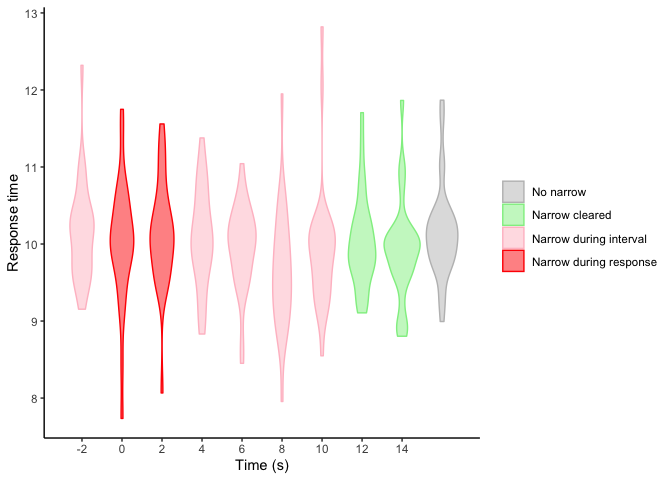
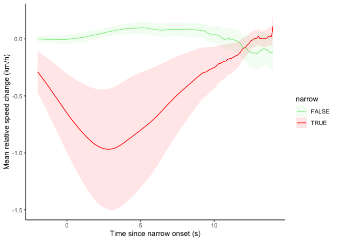
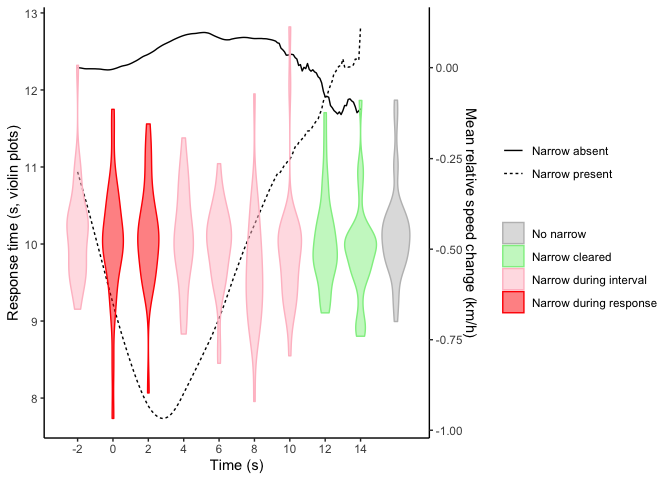
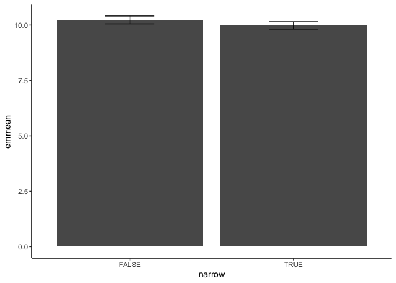
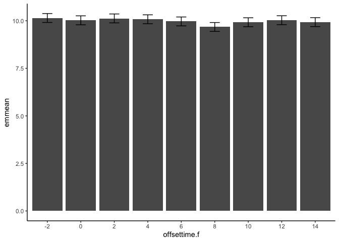
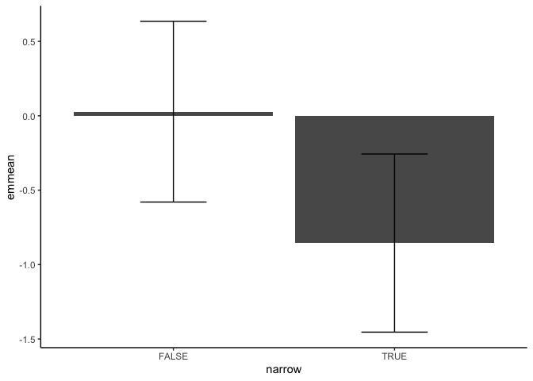

```
## Loading required package: Matrix
```

# Descriptive figures

## Timing

Point in time when response is required (offset time) relative to start of narrow


```r
timing_meandat <- timing_dat[outlier == 0, .(rt = mean(rt)), by = .(onsettime, offsettime, barcol, pp_id)]
ggplot() +
  geom_violin(data = timing_meandat, aes(fill = barcol, color = barcol, x = offsettime, y = rt, gr = as.factor(offsettime)), alpha = .5) +
  scale_color_identity(guide = "legend", labels = c("No narrow", "Narrow cleared", "Narrow during interval", "Narrow during response")) +
  scale_fill_identity(guide = "legend", labels = c("No narrow", "Narrow cleared", "Narrow during interval", "Narrow during response")) +
  scale_x_continuous(breaks = seq(-2, 14, by = 2)) +
  labs(x = "Time (s)", y = "Response time", fill = NULL, color = NULL)
```

```
## Warning: Ignoring unknown aesthetics: gr
```

<!-- -->

## Driving

Change in velocity since baseline period (-5 to -3 seconds before onset of the narrow). Comparing trials in which there was no narrow present (so baselining is a bit arbitrary) and trials in which it was.


```r
driving_meandat <- driving_dat[t_onset %between% c(-2, 14), .(velocity.bl = mean(velocity.bl)), by = .(t_onset, narrow, pp_id)]
driving_meandat <- driving_meandat[, .(velocity.bl = mean(velocity.bl), se = sd(velocity.bl)/sqrt(.N)), by = .(t_onset, narrow)]
ggplot(driving_meandat, aes(x = t_onset, y = velocity.bl, color = narrow)) +
  geom_line() +
  geom_ribbon(data = driving_meandat, aes(ymin = velocity.bl - se, ymax = velocity.bl + se, fill = narrow, x = t_onset), color = NA, alpha = .1) +
  scale_color_manual(values = c("lightgreen", "red")) +
  scale_fill_manual(values = c("lightgreen", "red")) +
  labs(x = "Time since narrow onset (s)", y = "Mean relative speed change (km/h)")
```

<!-- -->

## Combined

Combining the two figures


```r
timing_meandat[, rt.sc := rescale(rt, to = range(driving_meandat$velocity.bl))]
driving_meandat[, velocity.bl.sc := rescale(velocity.bl, to = range(timing_meandat$rt))]

ggplot() +
  geom_line(data = driving_meandat, aes(x = t_onset, y = velocity.bl.sc, linetype = narrow)) +
  geom_violin(data = timing_meandat, aes(fill = barcol, color = barcol, x = offsettime, y = rt, group = as.factor(offsettime)), alpha = .5) +
  scale_color_identity(guide = "legend", labels = c("No narrow", "Narrow cleared", "Narrow during interval", "Narrow during response")) +
  scale_fill_identity(guide = "legend", labels = c("No narrow", "Narrow cleared", "Narrow during interval", "Narrow during response")) +
  scale_linetype_discrete(labels = c("Narrow absent", "Narrow present")) +
  scale_x_continuous(breaks = seq(-2, 14, by = 2)) +
  scale_y_continuous(sec.axis = sec_axis(~ (. - min(timing_meandat$rt)) / diff(range(timing_meandat$rt)) * diff(range(driving_meandat$velocity.bl)) + min(driving_meandat$velocity.bl), name = "Mean relative speed change (km/h)")) +
  labs(x = "Time (s)", y = "Response time (s, violin plots)", linetype = NULL, fill = NULL, color = NULL)
```

<!-- -->

# LMERS

## Timing

### Narrow yes of no

Estimate Linear Mixed Effects Regression model with Response Time (```rt```) as dependent continuous variable and ```pp_id``` as random factor. Compare intercept only model to model that includes whether or not that trial included a narrow (```narrow```) by estimating BF (Wagemakers, 2007).


```r
tm0 <- lmer(data = timing_dat, rt ~ 1 + (1|pp_id))
tm1 <- lmer(data = timing_dat, rt ~ narrow + (1|pp_id))
exp((BIC(tm0) - BIC(tm1))/2)
```

```
## [1] 35.12592
```

```r
summary(tm1)
```

```
## Linear mixed model fit by REML ['lmerMod']
## Formula: rt ~ narrow + (1 | pp_id)
##    Data: timing_dat
## 
## REML criterion at convergence: 12988.1
## 
## Scaled residuals: 
##     Min      1Q  Median      3Q     Max 
## -6.4045 -0.4538 -0.0365  0.4268  7.7786 
## 
## Random effects:
##  Groups   Name        Variance Std.Dev.
##  pp_id    (Intercept) 0.1874   0.4329  
##  Residual             2.7182   1.6487  
## Number of obs: 3366, groups:  pp_id, 30
## 
## Fixed effects:
##             Estimate Std. Error t value
## (Intercept) 10.23228    0.09224  110.93
## narrowTRUE  -0.25918    0.05930   -4.37
## 
## Correlation of Fixed Effects:
##            (Intr)
## narrowTRUE -0.413
```

```r
plotdat <- data.table(data.frame(emmeans(tm1, 
                                         specs = c("narrow"),
                                         at = list(narrow = c(TRUE, FALSE)),
                                         type = "response")))
```

```
## Note: D.f. calculations have been disabled because the number of observations exceeds 3000.
## To enable adjustments, add the argument 'pbkrtest.limit = 3366' (or larger)
## [or, globally, 'set emm_options(pbkrtest.limit = 3366)' or larger];
## but be warned that this may result in large computation time and memory use.
```

```
## Note: D.f. calculations have been disabled because the number of observations exceeds 3000.
## To enable adjustments, add the argument 'lmerTest.limit = 3366' (or larger)
## [or, globally, 'set emm_options(lmerTest.limit = 3366)' or larger];
## but be warned that this may result in large computation time and memory use.
```

```r
ggplot(plotdat, aes(x = narrow, y = emmean)) +
  geom_bar(stat = "identity") +
  geom_errorbar(aes(ymin = asymp.LCL, ymax = asymp.UCL), width = .3)
```

<!-- -->

BF of 35 indicates the presence of a narrow has an effect on rt. With a narrow present, rts are 260 ms shorter (2.6%). 

### Per offset time 

Offset time relative to start of narrow


```r
offsetdat <- timing_dat[narrow == T & outlier == 0]
offsetdat$offsettime.f <- factor(as.character(offsetdat$offsettime), levels = as.character(seq(-2, 14, by = 2)))
tm0 <- lmer(data = offsetdat, rt ~ 1 + (1|pp_id))
tm2 <- lmer(data = offsetdat, rt ~ offsettime.f + (1|pp_id))
exp((BIC(tm0) - BIC(tm2))/2)
```

```
## [1] 3.037771e-14
```

```r
emmean <- emmeans(tm2, 
                  specs = c("offsettime.f"),
                  at = list(offsettime.f = levels(offsetdat$offsettime.f)),
                  type = "response")
plotdat <- data.table(data.frame(emmean))
ggplot(plotdat, aes(x = offsettime.f, y = emmean)) +
  geom_bar(stat = "identity") +
  geom_errorbar(aes(ymin = lower.CL, ymax = upper.CL), width = .3)
```

<!-- -->

BF < 0.001 indicates no difference between conditions. If anything, when response is require 8 seconds after they've entered the narrow (i.e., they've been out of it for 5), they respond a bit faster. 

*TODO: Decide if we want to post hoc test on 8 after seeing this. *

### Initial hypothesis

Re-code variables to compare the mean of offset time 0 and 2 to the mean of the rest


```r
hypothdat <- timing_dat[narrow == T & outlier == 0]
hypothdat[, in_narrow := ifelse(offsettime %in% c(0, 2), TRUE, FALSE)]
tm0 <- lmer(data = hypothdat, rt ~ 1 + (1|pp_id))
tm1 <- lmer(data = hypothdat, rt ~ in_narrow + (1|pp_id))
exp((BIC(tm0) - BIC(tm1))/2)
```

```
## [1] 0.01311722
```

```r
hypothemmean <- emmeans(tm1, 
                        specs = c("in_narrow"),
                        at = list(in_narrow = c(TRUE, FALSE)),
                        type = "response")
plotdat <- data.table(data.frame(hypothemmean))
ggplot(plotdat, aes(x = in_narrow, y = emmean)) +
  geom_bar(stat = "identity") +
  geom_errorbar(aes(ymin = lower.CL, ymax = upper.CL), width = .3)
```

<!-- -->

BF = 0.013, thus no effect of having to respond while in narrow

## Driving


```r
driving_windat <- driving_dat[t_onset %between% c(0, 3), .(velocity.bl = mean(velocity.bl)), by = .(pp_id, trial, narrow)]
dm0 <- lmer(data = driving_windat, velocity.bl ~ 1 + (1|pp_id))
dm1 <- lmer(data = driving_windat, velocity.bl ~ narrow +  (1|pp_id))
exp((BIC(dm0) - BIC(dm1))/2)
```

```
## [1] 1.658032e+15
```

```r
summary(dm1)
```

```
## Linear mixed model fit by REML ['lmerMod']
## Formula: velocity.bl ~ narrow + (1 | pp_id)
##    Data: driving_windat
## 
## REML criterion at convergence: 15688
## 
## Scaled residuals: 
##     Min      1Q  Median      3Q     Max 
## -9.7627 -0.2145  0.0687  0.2407  6.1527 
## 
## Random effects:
##  Groups   Name        Variance Std.Dev.
##  pp_id    (Intercept) 2.606    1.614   
##  Residual             7.088    2.662   
## Number of obs: 3248, groups:  pp_id, 29
## 
## Fixed effects:
##             Estimate Std. Error t value
## (Intercept)  0.02741    0.30979   0.088
## narrowTRUE  -0.88279    0.09749  -9.055
## 
## Correlation of Fixed Effects:
##            (Intr)
## narrowTRUE -0.202
```

```r
plotdat <- data.table(data.frame(emmeans(dm1, 
                                         specs = c("narrow"),
                                         at = list(narrow = c(TRUE, FALSE)),
                                         type = "response")))
```

```
## Note: D.f. calculations have been disabled because the number of observations exceeds 3000.
## To enable adjustments, add the argument 'pbkrtest.limit = 3248' (or larger)
## [or, globally, 'set emm_options(pbkrtest.limit = 3248)' or larger];
## but be warned that this may result in large computation time and memory use.
```

```
## Note: D.f. calculations have been disabled because the number of observations exceeds 3000.
## To enable adjustments, add the argument 'lmerTest.limit = 3248' (or larger)
## [or, globally, 'set emm_options(lmerTest.limit = 3248)' or larger];
## but be warned that this may result in large computation time and memory use.
```

```r
ggplot(plotdat, aes(x = narrow, y = emmean)) +
  geom_bar(stat = "identity") +
  geom_errorbar(aes(ymin = asymp.LCL, ymax = asymp.UCL), width = .3)
```

<!-- -->

BF of > 1000 indicates the presence of a narrow has an effect on speed. With a narrow present, speed decreases by 0.88 km/h. 

## Combined


```r
combdat <- merge(driving_windat, 
                 offsetdat, by = c("pp_id", "trial", "narrow"))
cm0 <- lmer(data = combdat, rt ~ 1 + (1|pp_id))
cm1 <- lmer(data = combdat, rt ~ velocity.bl * offsettime.f + (1|pp_id))
exp((BIC(cm0) - BIC(cm1))/2)
```

```
## [1] 2.32713e-34
```

```r
summary(cm1)
```

```
## Linear mixed model fit by REML ['lmerMod']
## Formula: rt ~ velocity.bl * offsettime.f + (1 | pp_id)
##    Data: combdat
## 
## REML criterion at convergence: 7066.4
## 
## Scaled residuals: 
##     Min      1Q  Median      3Q     Max 
## -5.3768 -0.5467 -0.0285  0.5046  5.8253 
## 
## Random effects:
##  Groups   Name        Variance Std.Dev.
##  pp_id    (Intercept) 0.2016   0.449   
##  Residual             1.8290   1.352   
## Number of obs: 2019, groups:  pp_id, 29
## 
## Fixed effects:
##                             Estimate Std. Error t value
## (Intercept)                10.108677   0.124292  81.330
## velocity.bl                -0.060024   0.034369  -1.746
## offsettime.f0              -0.115213   0.132014  -0.873
## offsettime.f2               0.031928   0.130875   0.244
## offsettime.f4              -0.089425   0.130211  -0.687
## offsettime.f6              -0.194954   0.130333  -1.496
## offsettime.f8              -0.452015   0.129946  -3.478
## offsettime.f10             -0.152932   0.129596  -1.180
## offsettime.f12             -0.065594   0.131210  -0.500
## offsettime.f14             -0.205638   0.131387  -1.565
## velocity.bl:offsettime.f0   0.040688   0.042576   0.956
## velocity.bl:offsettime.f2   0.075065   0.042853   1.752
## velocity.bl:offsettime.f4  -0.006198   0.040732  -0.152
## velocity.bl:offsettime.f6  -0.013975   0.042986  -0.325
## velocity.bl:offsettime.f8   0.056879   0.040756   1.396
## velocity.bl:offsettime.f10  0.118511   0.043376   2.732
## velocity.bl:offsettime.f12  0.076615   0.041288   1.856
## velocity.bl:offsettime.f14  0.043968   0.041240   1.066
```

```
## 
## Correlation matrix not shown by default, as p = 18 > 12.
## Use print(x, correlation=TRUE)  or
##     vcov(x)        if you need it
```

```r
quants <- quantile(driving_windat$velocity.bl, p = c(.05, .95))
seq(quants[1], quants[2], length.out = 5)
```

```
## [1] -4.7589012 -3.0140842 -1.2692672  0.4755498  2.2203668
```

```r
plotdat <- data.table(data.frame(emmeans(cm1, 
                                         specs = c("velocity.bl", "offsettime.f"),
                                         at = list(velocity.bl = quantile(driving_windat$velocity.bl, p = c(.1, .25, .5, .75, .9)), offsettime.f = levels(offsetdat$offsettime.f)),
                                         type = "response")))
ggplot(plotdat, aes(x = offsettime.f, y = emmean)) +
  geom_bar(stat = "identity") +
  geom_errorbar(aes(ymin = lower.CL, ymax = upper.CL), width = .3) +
  facet_wrap(~velocity.bl)
```

<!-- -->

BF < 0.0001 indicates no interaction between offset time and speed. 5 plots for the .1, .25, .5, .75 and .9 quantiles of velocities.
